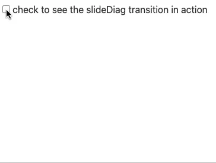

# svelte-slidediag-transition

A simple transition for [Svelte](https://svelte.dev/). Like Svelte's built-in [`slide` transition](https://svelte.dev/docs#slide) except this one expands horizontally as well as vertically (hence "diag" for "diagonal"):

See the **[demo here](https://svelte.dev/repl/08b2fb75b92f405a80606374a4102f58?version=3.23.2)**.

## Install

`npm install svelte-slidediag-transition`

